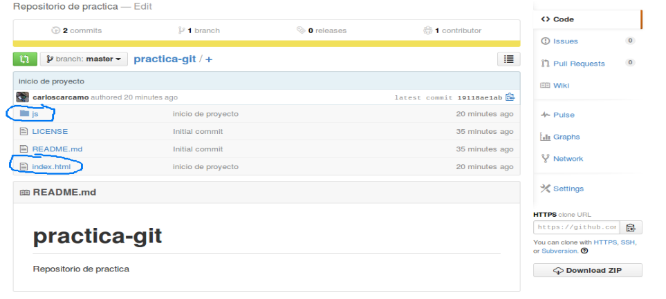

##ENVIANDO CAMBIOS AL REPOSITORIO REMOTO

Ahora estamos listos para agregar y modificar nuevos archivos dentro de este repositorio y enviar los cambios a github, procedamos entonces agregando un par de archivos y directorios:

```
$ mkdir css js
$ touch index.html
```

Hemos añadido dos directorios y un archivo nuevos, veamos que ha detectado git dentro de nuestro repositorio:

```
$ git status
# On branch master 
# Untracked files: 
#   (use "git add <file>..." to include in what will be committed) 
# 
#	index.html 
nothing added to commit but untracked files present (use "git add" to track)
```

A pesar de que hemos agregado dos directorios nuevos, git no detecta esos cambios, eso es debido a que git no lleva control de los directorios sino de archivos, al momento en que agreguemos un archivo en cualquiera de esos directorios podremos ver que git nos informará de ello, creemos un archivo entonces dentro de uno de esos directorios:

```
$ touch js/app.js
$ git status
# On branch master 
# Untracked files: 
#   (use "git add <file>..." to include in what will be committed) 
# 
#	index.html 
#	js/ 
nothing added to commit but untracked files present (use "git add" to track)
```

Todo bien, ahora agreguemos los archivos y hagamos un commit:

```
$ git add .
$ git commit -am “Inicio de proyecto”
[master 19118ae] inicio de proyecto 
 0 files changed 
 create mode 100644 index.html 
 create mode 100644 js/app.js
$ git status
# On branch master 
# Your branch is ahead of 'origin/master' by 1 commit. 
# 
nothing to commit (working directory clean)
```

Veamos ahora la salida del comando git status, __“Your branch is ahead of 'origin/master' by 1 commit.”__ nos indica que tenemos cambios en nuestro repositorio local que no han sido enviados al repositorio remoto. Podemos comprobar si tenemos diferencias entre nuestra repo local y la repo remota haciendo un diff así:

```
$ git diff origin/master master 
diff --git a/index.html b/index.html 
new file mode 100644 
index 0000000..e69de29 
diff --git a/js/app.js b/js/app.js 
new file mode 100644 
index 0000000..e69de29 
```

Enviemos nuestros cambios a github:

```
$ git push origin master
Username for 'https://github.com': 
Password for 'https://carloscarcamo@github.com':
To https://github.com/carloscarcamo/practica-git.git 
   7369319..19118ae  master -> master
```
```
$ git status
# On branch master 
nothing to commit (working directory clean)
```

Git nos pide nuestro usuario y contraseña para poder enviar los cambios, luego podemos ver que  git status nos muestra que tenemos nuestro repositorio local y remoto actualizados. Podemos ver también en github que los cambios han sido efectuados correctamente:




